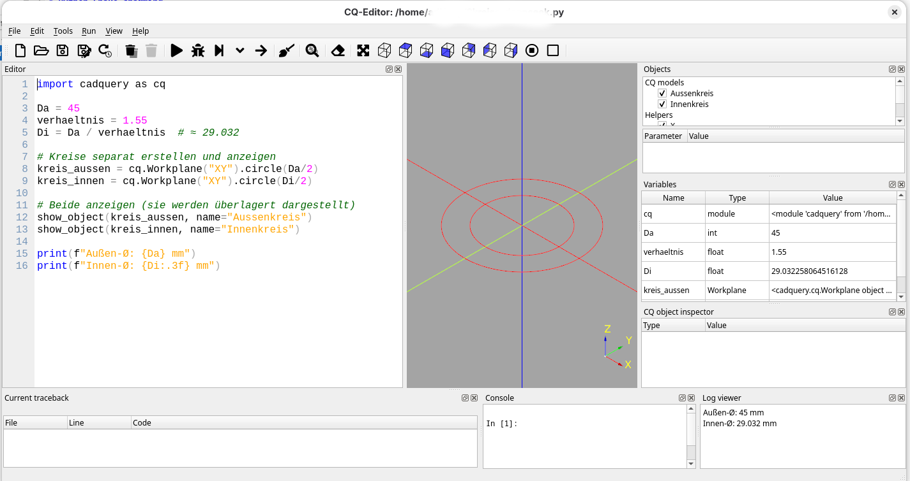
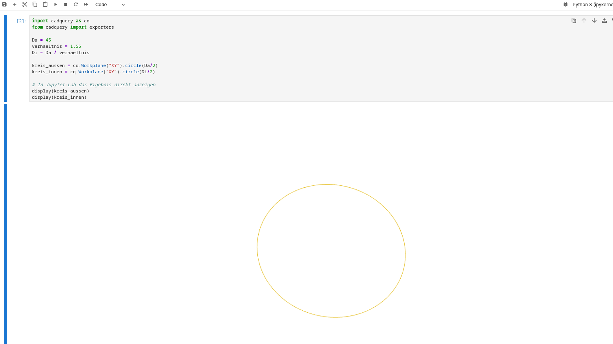

# Python Snake charming

# cadquery experimente
um CadQuery nutzen zu können sollte man Python 3.11 nutzen
# uv als sehr schnellen installer (Rust basiert) dem langsamen pip vorziehen
```
uv python install 3.11
uv venv --python 3.11
source .venv/bin/activate
uv pip install jupyterlab cadquery jupyter-cadquery CQ-editor 
```
# CQ-Editor
```
me@fedora:~$ source .venv/bin/activate
(me) me@fedora:~$  CQ-editor 
```


# CadQuery in Jupyther-Lab
```
me@fedora:~$ source .venv/bin/activate
me@fedora:~$ jupyter-lab
```



# CadQuery in VS-Code to be done
